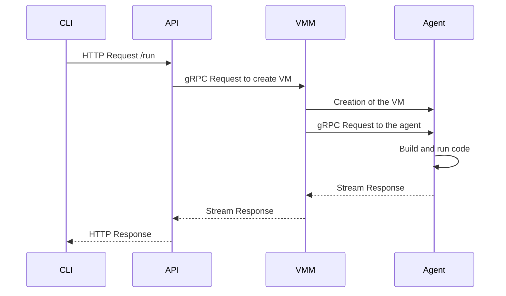

<div style="text-align:center">
    <h1> Cloudlet</h1>
    <p>The almost fast FaaS</p>
    
</div>

## Table of Contents

- [Table of Contents](#table-of-contents)
- [Run Locally](#run-locally)
  - [Clone the project](#clone-the-project)
  - [Go to the project directory](#go-to-the-project-directory)
  - [Run the API](#run-the-api)
  - [Start the VMM](#start-the-vmm)
  - [Send the request using the cli](#send-the-request-using-the-cli)
- [Architecture](#architecture)


## Run Locally

### Clone the project

```bash
  git clone https://github.com/virt-do/cloudlet
```

### Go to the project directory

```bash
  cd cloudlet
```

Create a toml config file or update the [existing one](./src/agent/examples/config.toml)

```toml
workload-name = "fibonacci"
language = "rust"
action = "prepare-and-run"

[server]
address = "localhost"
port = 50051

[build]
source-code-path = "CHANGE/cloudlet/src/agent/examples/main.rs"
release = true
```

Here make sure to update the source-code-path to the path of the source code you want to run. Use an absolute path.


### Run the API
```bash
  cargo run --bin api
```

### Start the VMM

```bash
  sudo -E capsh --keep=1 --user=$USER --inh=cap_net_admin --addamb=cap_net_admin -- -c  'RUST_BACKTRACE=1 '$CARGO_PATH' run --bin vmm -- grpc'
``` 

⚠️ Make sure to replace $CARGO_PATH with the path to your cargo binary

```bash
  export CARGO_PATH=$(which cargo)
```

### Send the request using the cli 

```bash
  cargo run --bin cli run --config-path src/agent/examples/config.toml
```

> Note: If it's your first time running the request cloudlet will have to compile a kernel and an initramfs image. This will take a while so make sure you do something else while you wait ...

## Architecture


Here is a simple sequence diagram of the architecture of Cloudlet. The CLI sends an HTTP request to the API which in turn sends a gRPC request to the VMM. The VMM then creates a VM. When a VM starts it boots on the agent which holds another gRPC server to handle requests. The agent then builds and runs the code. The response is streamed back to the VMM and then to the API and finally to the CLI.
